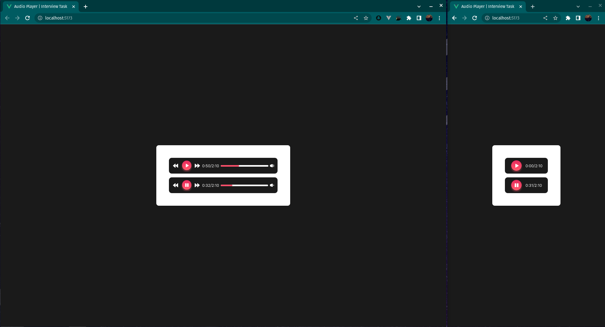

# Task | Audio Player

- Built with **Vue** Composition API
- Built with **TypeScript**
- Built with **Vue 3** composables
- Unit tests
- Tailwind CSS
- Responsive

## Demo



## Node Version

- node: `20.2.0`
- npm: `9.6.6`

## Installation | Native Development

```bash
npm ci
```

Run vite dev server

```bash
npm run dev
```

Run run unit tests with watch
```bash
npm run test:dev
```

Run run unit tests without watch files
```bash
npm run test
```

## Examples

- ### useAudio composable

  ```js
  <script setup lang="ts">
  import { useAudio } from '@/composables/useAudio'

  const {
    isMuted,
    totalTime,
    isPlaying,
    currentTime,
    togglePlayback,
    toggleVolume,
    goBackward,
    goForward
  } = useAudio({ autoPlay: false })
  </script>
  ```
- ### AudioPlayer component

  ```html
  <template>
    <AudioPlayer :auto-play="true" />
  </template>
  ```

- ### AudioPlayer component with slots

  ```html
  <AudioPlayer :auto-play="false">
    <template #progress="{ progress }">
      ...
    </template>
    <template #timer="{ currentTime, totalTime, digitalTimer }">
      ...
    </template>
  </AudioPlayer>
  ```

## useAudioOptions

| Name         | Type    |
| ------------ |---------|
| autoPlay     | boolean  |

- `autoPlay` is a boolean value, if true the audio shall starts onMounted
